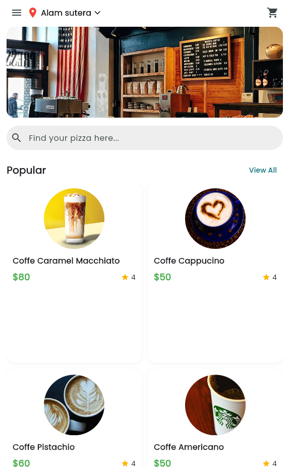

# Marketplace App
<p align="center">
  
</p>
 
<p align="center">Logo.</p>

## Installation For Window/VPS
Running Program
```bash
flutter pub get
flutter run -d chrome --web-port=3000
```

## License

This project is under the [Yanzz](https://github.com/Yanzz231)

## Helper 🤖

Just DM me with instagram [Yanz](https://www.instagram.com/iyanmikasa/)
